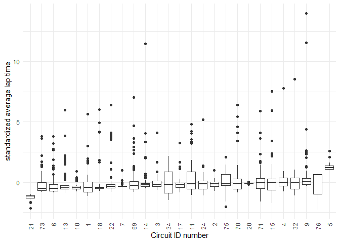

Lilo Heinrich, Tim Novak, and Colin Takeda
12-14-2020

  - [Data Background](#data-background)
      - [Context](#context)
      - [Source](#source)
  - [Investigation Question](#investigation-question)
      - [Does the car or the driver have the greater
        impact?](#does-the-car-or-the-driver-have-the-greater-impact)
  - [Data Tidying](#data-tidying)
      - [Time data](#time-data)
      - [Potential Problems](#potential-problems)
  - [Exploratory Data Analysis](#exploratory-data-analysis)
      - [Standardized Average Lap Time](#standardized-average-lap-time)
      - [Standardized Average Lap Time by
        Circuit](#standardized-average-lap-time-by-circuit)
      - [Modeling by standard average lap
        time](#modeling-by-standard-average-lap-time)
      - [Modeling Using Final Position
        Order](#modeling-using-final-position-order)
  - [Final Position](#final-position)
      - [Modelling by Final Position](#modelling-by-final-position)
      - [Probability Intervals](#probability-intervals)
  - [Conclusion](#conclusion)
  - [Rubrics](#rubrics)

<center>

<h1>

Formula 1 Racing: <br /> Does the car or the driver have the greater
impact?

</h1>

</center>

## Data Background

#### Context

The Formula 1 World Championship has been one of the premier forms of
auto racing around the world since its inaugural season in 1950. The
word “formula” refers to the set of rules to which all participants’
cars must conform. A Formula 1 season consists of a series of Grands
Prix races which take place worldwide on circuits and closed public
roads.

#### Source

The [Formula 1 World
Championships](https://www.kaggle.com/rohanrao/formula-1-world-championship-1950-2020)
dataset consists of all information on the Formula 1 races, drivers,
constructors, qualifying, circuits, lap times, pit stops, and
championships for every season from 1950 to 2020.

This dataset was published by Rohan Rao, a Data Scientist who goes by
the name [Vopani](https://www.kaggle.com/rohanrao) on Kaggle. (Fun fact:
he is also the reigning National Sudoku Champion of India.) He compiled
this dataset using the [Ergast Developer API](http://ergast.com/mrd/),
an experimental web service that provides a historical record of motor
racing data for non-commercial purposes. The API provides data
specifically for the Formula One series, from the beginning of the world
championships in 1950 up to the present season.

The Ergast API website does not give any details about their data
collection procedures, but their data is very thorough and complete.
Additionally, Formula 1 world championships are internationally
televised and race results are publicly accessible information [(see
official Formula 1 website)](https://www.formula1.com/en/results.html),
so there is no reason to doubt the accuracy of the data reported.

-----

## Investigation Question

#### Does the car or the driver have the greater impact?

Unlike most sports, Formula 1 racing is heavily reliant on the
performance capability of their equipment, which is their cars that are
created by the constructors. To what extent do the constructor and
driver predict race performance, and which one has the greater
predictive capability?

-----

## Data Tidying

The data came in many separate files, including `results.csv`,
`drivers.csv`, `constructors.csv`, `circuits.csv`, `races.csv`,
`status.csv`, and `laptimes.csv`. Our first step was to join all of
these data frames together by their relevant ID numbers and replace the
missing values with `NA`.

In our dataset we kept these columns:

  - resultId
  - raceId
  - driverId
  - constructorId
  - positionOrder
  - laps
  - fastestLapSpeed
  - statusId
  - driver\_name
  - constructor\_name
  - year
  - round
  - circuitId
  - race\_name
  - status
  - circuit\_name

#### Time data

The column `milliseconds` reports the race completion time for all of
the drivers that were able to finish the race. However, drivers are
often unable to complete the full race due to collisions, car
breakdowns, or other problems, leaving many missing values for total
race time. We discarded `milliseconds` and created a second dataset
where we supplemented information from `laptimes.csv` to compute total
race time even when race status was not finished. The lap times were
understandably missing when the number of laps completed was 0, so we
removed these observations. Overall, we still only have lap times for
9,233 of our 24,900 though.

In this time-filtered dataset we added these columns:

  - total\_time
  - avg\_lap
  - circuit\_avg\_lap
  - circuit\_lap\_sd
  - std\_avg\_lap

#### Potential Problems

  - Some examples of [constructor name
    changes](https://www.reddit.com/r/formula1/comments/1dos3r/i_made_a_diagram_to_show_how_current_f1_teams/)

  - Rules change year to year and can significantly affect performance

  - New drivers are skewed because they don’t have as many data points
    yet

  - This data is for 70 years of races and [formula racing has changed a
    lot](https://youtu.be/hgLQWIAaCmY)
    
      - Consider filtering on year \>= 2000

-----

## Exploratory Data Analysis

#### Standardized Average Lap Time

<!-- -->

As shown in the graph above, final position is heavily reliant on how
many laps the driver was able to complete. And almost a third of the
time, collisions or car troubles put drivers out of commission before
the race is finished. These final standings are not reflective of how
well the driver was doing before that point, so we decided to use
average lap time to create a more comprehensive performance metric.

Average lap time is a comprehensive measure of how well a driver
performed in a race because it is informed only on the laps they were
able to complete, unlike final position. The only problem is that it
doesn’t account for the effect of circuit on lap time, so we need to
correct for this difference across circuits.

<!-- -->

The average lap time varies across circuits due to the differences in
track length and shape, so we need a way to compare average lap time
across circuits. Dividing average lap time by average lap time per
circuit doesn’t work because it doesn’t account for the range of average
lap time on each circuit. To correct for the impact of circuit on
average lap time, we standardized by circuit:

\[\mu = \sum_{i}^{n} \frac{x_i}{n}\]

\[\sigma = \sqrt{\sum_{i}^{n} \frac{(x_i - \mu)^2}{n}}\]

\[z = \frac{x-\mu}{\sigma}\]

where \(x\) is the data, \(\mu\) is the mean, \(\sigma\) is the standard
deviation, and \(z\) is the standard score of \(x\)

#### Standardized Average Lap Time by Circuit

<!-- -->

The graph above shows a visual comparison of standardized average lap
time by circuit. The slope of the median is small in magnitude relative
to the range of the standardized average lap time, showing that
standardizing the average lap time successfully minimizes the effect of
circuit.

#### Modeling by standard average lap time

First, let’s model the ***entire data set*** to get a sense of how
informative a linear model is for our dataset, solely based upon driver,
constructor, and a combination of the two.

``` r
f_driv_sal <-
  df_timedata %>%
  lm(
    data = .,
    formula = std_avg_lap ~ as.factor(driverId)
  )

f_cons_sal <- 
  df_timedata %>% 
  lm(
    data = .,
    formula = std_avg_lap ~ as.factor(constructorId)
  )

f_drivcons_sal <- 
  df_timedata %>% 
  lm(
    data = .,
    formula = std_avg_lap ~ as.factor(driverId) + as.factor(constructorId)
  )
```

    ## Full Fit - Just Driver

    ##   Rsquare 0.05748965

    ##   MSE 0.9387334

    ## Full Fit - Just Constructor

    ##   Rsquare 0.04633339

    ##   MSE 0.9498449

    ## Full Fit - Driver and Constructor

    ##   Rsquare 0.08119187

    ##   MSE 0.9151261

Starting with looking at the mean square error (MSE) we can compare the
different fits against one another. Between fits, the error is lowest
with both `driver and constructor`. The “goodness of fit” is best with
both factors involved, which may imply that both are informative towards
standard average lap time. However, the difference is quite small
between MSEs, so the predictive capabilities of both at all still seem
minute. The order of best fit to worst, solely based upon MSE, is driver
and constructor, just driver, and finally just constructor. These
results may imply that driver is a better predictor of outcome than
constructor, but this is not necessarily the case.

Looking next at our rsquared value we see that our models do **not**
have very good coverage of the data. We are looking at each model only
covering around `4.6% to 8.1%` of the data, which calls into question
the validity the comparisons made for our MSE. The order of best model
to worst, solely based upon rsquare, is driver and constructor, just
driver, and finally just constructor, so the overall standings seem to
follow the exact same trend seen in both MSE and rsquare.

These models should be taken with a grain or more of salt as we are
using the entire data set to create them, so we don’t have a separate
training and validation data set. However, using a split of the dataset
for training and the rest for validation will not increase the accuracy
of the model. With such a low predictive capability already it doesn’t
appear to be useful to fit additional models.

#### Modeling Using Final Position Order

``` r
df_data_with_rows <- tibble::rowid_to_column(df_data, "ID")

df_train_pos <-
  df_data_with_rows %>%
  group_by(driverId, constructorId, circuitId) %>% 
  slice_sample(n = 1) %>% 
  ungroup()

df_validate_pos <-
  anti_join(
    df_data_with_rows,
    df_train_pos,
    by = "ID"
  )
```

``` r
f_driv_pos <-
  df_train_pos %>%
  lm(
    data = .,
    formula = positionOrder ~ as.factor(driverId)
  )

f_cons_pos <- 
  df_train_pos %>% 
  lm(
    data = .,
    formula = positionOrder ~ as.factor(constructorId)
  )

f_drivcons_pos <- 
  df_train_pos %>% 
  lm(
    data = .,
    formula = positionOrder ~ as.factor(driverId) + as.factor(constructorId)
  )
```

    ## Train Fit - Just Driver

    ##   Rsquare 0.1535804

    ##   MSE 46.92211

    ## Train Fit - Just Constructor

    ##   Rsquare 0.1657483

    ##   MSE 46.74937

    ## Train Fit - Driver and Constructor

    ##   Rsquare 0.1903318

    ##   MSE 44.4221

## Final Position

#### Modelling by Final Position

#### Probability Intervals

If possible given your data, report all estimates with confidence /
prediction / tolerance intervals. If not possible, clearly explain why
it is not possible to provide intervals and document what sources of
uncertainty are not quantified.

-----

## Conclusion

testing testing testing

-----

## Rubrics

Questions to answer:

  - What question did you set out to answer?
  - What data did you find to help answer that question?
  - What is the relevant background on your question?
  - What level of (quantified) certainty do you have in your results?
  - What conclusions did you come to?
  - What questions do you have remaining?
  - Make sure your report contains at least one presentation-quality
    figure

Observed:

  - (The usual stuff)
  - Must provide background
  - Must posit a question

Supported:

  - (The usual stuff)
  - Some analysis must support answering question

Assessed:

  - (The usual stuff)
  - All estimates must be provided with some quantification of
    uncertainty (e.g. confidence / prediction / tolerance intervals), OR
    a justification for why producing an interval is not possible and
    documentation for sources of uncertainty not accounted for.

Styled:

  - (The usual stuff)
  - Report must contain at least one presentation-quality figure
