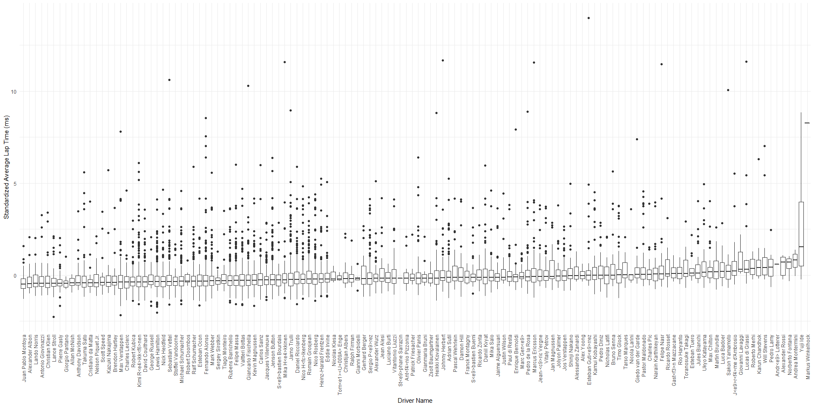

  - [Data Background](#data-background)
      - [Context](#context)
      - [Source](#source)
  - [Investigation Question](#investigation-question)
      - [Does the car or the driver have the greater
        impact?](#does-the-car-or-the-driver-have-the-greater-impact)
  - [Data Tidying](#data-tidying)
      - [Missing or erroneous data](#missing-or-erroneous-data)
      - [Final dataset](#final-dataset)
      - [Potential Problems](#potential-problems)
  - [Exploratory Data Analysis](#exploratory-data-analysis)
      - [Standardize by Average Lap
        Time](#standardize-by-average-lap-time)
      - [Assess Standardized Average Lap Time
        vs. Circuit](#assess-standardized-average-lap-time-vs.-circuit)
  - [Linear Model by final position](#linear-model-by-final-position)
      - [Uncertainty Quantification / Prediction
        Interval](#uncertainty-quantification-prediction-interval)
  - [Conclusion](#conclusion)
  - [Rubrics](#rubrics)

<h1>

Formula 1 Racing:   Does the car or the driver have the greater
impact?

</h1>

## Data Background

#### Context

The Formula 1 World Championship has been one of the premier forms of
auto racing around the world since its inaugural season in 1950. The
word “formula” refers to the set of rules to which all participants’
cars must conform. A Formula 1 season consists of a series of Grands
Prix races which take place worldwide on circuits and closed public
roads.

#### Source

The [Formula 1 World
Championships](https://www.kaggle.com/rohanrao/formula-1-world-championship-1950-2020)
dataset consists of all information on the Formula 1 races, drivers,
constructors, qualifying, circuits, lap times, pit stops, and
championships for every season from 1950 to 2020.

This dataset was published by Rohan Rao, a Data Scientist who goes by
the name [Vopani](https://www.kaggle.com/rohanrao) on Kaggle. (Fun fact:
he is also the reigning National Sudoku Champion of India.) He compiled
this dataset using the [Ergast Developer API](http://ergast.com/mrd/),
an experimental web service that provides a historical record of motor
racing data for non-commercial purposes. The API provides data
specifically for the Formula One series, from the beginning of the world
championships in 1950 up to the present season.

The Ergast API website does not give any details about their data
collection procedures, but their data is very thorough and complete.
Additionally, Formula 1 world championships are internationally
televised and race results are publicly accessible information [(see
official Formula 1 website)](https://www.formula1.com/en/results.html),
so there is no reason to doubt the accuracy of the data reported.

-----

## Investigation Question

#### Does the car or the driver have the greater impact?

Unlike most sports, Formula 1 racing is heavily reliant on the
performance capability of their equipment, which is their cars that are
created by the constructors. To what extent do the constructor and
driver predict race performance, and which one has the greater
predictive capability?

-----

## Data Tidying

The data came in many separate files, including `results.csv`,
`drivers.csv`, `constructors.csv`, `circuits.csv`, `races.csv`,
`status.csv`, and `laptimes.csv`. Our first step was to join all of
these data frames together by their relevant ID numbers and replace the
missing values with `NA`.

#### Missing or erroneous data

The column `milliseconds` reports the race completion time for all of
the drivers that were able to finish the race. However, drivers are
often unable to complete the full race due to collisions, car
breakdowns, or other problems, leaving many missing values for total
race time. We discarded `milliseconds` and supplemented information from
`laptimes.csv` to compute total race time even when race status was not
finished. The lap times were understandably missing when the number of
laps completed was 0, so we removed these observations.

#### Final dataset

In our final dataset we kept these columns:

  - resultId
  - raceId
  - driverId
  - constructorId
  - positionOrder
  - laps
  - fastestLapSpeed
  - statusId
  - driver\_name
  - constructor\_name
  - year
  - round
  - circuitId
  - race\_name
  - status
  - circuit\_name
  - total\_time
  - circuit\_avg\_lap
  - circuit\_lap\_sd
  - std\_avg\_lap

#### Potential Problems

  - Some examples of [constructor name
    changes](https://www.reddit.com/r/formula1/comments/1dos3r/i_made_a_diagram_to_show_how_current_f1_teams/)
  - Rules Era can change performance
  - New drivers are skewed because they don’t have as many data points
    yet
  - This data is for 70 years of races and many things have changed over
    that period

-----

## Exploratory Data Analysis

#### Standardize by Average Lap Time

<!-- -->

Upon consideration, final position ranking is heavily reliant on how
many laps the driver was able to complete. And almost a third of the
time, collisions or car troubles put drivers out of commission before
the race is finished. These final standings are not reflective of how
well the driver was doing before that point, so we decided to use
average lap time to create a more comprehensive performance metric.

Average lap time is a comprehensive measure of how well a driver
performed in a race because it is informed only on the laps they were
able to complete, unlike final position. The only problem is that it
doesn’t account for the effect of circuit on lap time, so we need to
correct for this difference across circuits.

<!-- -->

The average lap time can be drastically different across circuits due to
the differences in track length and shape, so we need a way to compare
average lap time across circuits. Dividing average lap time by average
lap time per circuit doesn’t work because it doesn’t account for the
range of average lap time on each circuit. To correct for the impact of
circuit on average lap time, we standardized by circuit:

\[\mu = \sum_{i}^{n} \frac{x_i}{n}\]

\[\sigma = \sqrt{\sum_{i}^{n} \frac{(x_i - \mu)^2}{n}}\]

\[z = \frac{x-\mu}{\sigma}\]

where \(x\) is the data, \(\mu\) is the mean, \(\sigma\) is the standard
deviation, and \(z\) is the standard score of \(x\)

<!-- -->

First of all, the graph of standardized average lap time by final
position shown above confirms the obvious: final ranking and
standardized average lap time are related. The faster you drive, the
more likely you are to win the race\! Secondly, there is an increasing
variability in the higher positions. This is almost certainly explained
by the fact that collisions or other car troubles reduce the likelihood
of being able to finish the race, thus increasing their position number,
independent of how well they were performing before their accident. The
vertical stratification could due to more competitive races raising the
standard for placing high, even when competing on the same track.

#### Assess Standardized Average Lap Time vs. Circuit

<!-- -->

The graph above shows a visual comparison of standardized average lap
time by circuit. What we hope to see is that standardized average lap
time minimizes the effect of circuit, and it seems it does because the
slope of the median is small in magnitude relative to the range of the
standardized average lap time. In conclusion, standardized average lap
time captures overall performance in a way that minimizes the effect of
number of laps driven and what circuit the race was held on.

However, when we applied a linear model using standard average lap time
as the performance metric with driver and constructor as inputs, we
found that it had an rsquare of only 0.08. This discouraging result told
us that standardized average lap time is very weakly correlated to
driver and constructor, so we decided to take our modelling attempts in
another direction.

## Linear Model by final position

\\TODO: Using final position in the race as our metric of performance,
the linear model relating driver and final position has an rsquare of
0.25 …

#### Uncertainty Quantification / Prediction Interval

If possible given your data, report all estimates with confidence /
prediction / tolerance intervals. If not possible, clearly explain why
it is not possible to provide intervals and document what sources of
uncertainty are not quantified.

-----

## Conclusion

testing testing testing

-----

## Rubrics

Questions to answer:

  - What question did you set out to answer?
  - What data did you find to help answer that question?
  - What is the relevant background on your question?
  - What level of (quantified) certainty do you have in your results?
  - What conclusions did you come to?
  - What questions do you have remaining?
  - Make sure your report contains at least one presentation-quality
    figure

Observed:

  - (The usual stuff)
  - Must provide background
  - Must posit a question

Supported:

  - (The usual stuff)
  - Some analysis must support answering question

Assessed:

  - (The usual stuff)
  - All estimates must be provided with some quantification of
    uncertainty (e.g. confidence / prediction / tolerance intervals), OR
    a justification for why producing an interval is not possible and
    documentation for sources of uncertainty not accounted for.

Styled:

  - (The usual stuff)
  - Report must contain at least one presentation-quality figure
