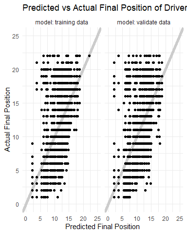

Lilo Heinrich, Tim Novak, and Colin Takeda
12-14-2020

  - [Data Background](#data-background)
      - [Context](#context)
      - [Data Source](#data-source)
  - [Investigation Question](#investigation-question)
      - [Does the car or the driver have the greater
        impact?](#does-the-car-or-the-driver-have-the-greater-impact)
  - [Data Tidying](#data-tidying)
      - [Time data](#time-data)
      - [Changes in racing ruleset/vehicle design through the
        years](#changes-in-racing-rulesetvehicle-design-through-the-years)
      - [Potential Problems](#potential-problems)
  - [Exploratory Data Analysis](#exploratory-data-analysis)
      - [Standardized Average Lap Time](#standardized-average-lap-time)
      - [Standardized Average Lap Time by
        Circuit](#standardized-average-lap-time-by-circuit)
      - [Modeling by Standardized Average Lap
        Time](#modeling-by-standardized-average-lap-time)
  - [Final Position Order](#final-position-order)
      - [Driver and Constructor by Final Position
        Order](#driver-and-constructor-by-final-position-order)
      - [Modelling by Final Position
        Order](#modelling-by-final-position-order)
      - [Prediction Interval](#prediction-interval)
      - [Assessing Final Position Order
        Models](#assessing-final-position-order-models)
      - [Quantifying uncertainty](#quantifying-uncertainty)
  - [Questions Remaining](#questions-remaining)
  - [Conclusion](#conclusion)

<h1>

Formula 1 Racing:   Does the car or the driver have the greater
impact?

</h1>

## Data Background

#### Context

The Formula 1 World Championship has been one of the premier forms of
auto racing around the world since its inaugural season in 1950. The
word “formula” refers to the set of rules to which all participants’
cars must conform. A Formula 1 season consists of a series of Grands
Prix races which take place worldwide on circuits and closed public
roads.

#### Data Source

The [Formula 1 World
Championships](https://www.kaggle.com/rohanrao/formula-1-world-championship-1950-2020)
dataset consists of all information on the Formula 1 races, drivers,
constructors, qualifying, circuits, lap times, pit stops, and
championships for every season from 1950 to 2020.

This dataset was published by Rohan Rao, a Data Scientist who goes by
the name [Vopani](https://www.kaggle.com/rohanrao) on Kaggle. (Fun fact:
he is also the reigning National Sudoku Champion of India.) He compiled
this dataset using the [Ergast Developer API](http://ergast.com/mrd/),
an experimental web service that provides a historical record of motor
racing data for non-commercial purposes. The API provides data
specifically for the Formula One series, from the beginning of the world
championships in 1950 up to the present season.

The Ergast API website does not give any details about their data
collection procedures, but their data is very thorough and complete.
Additionally, Formula 1 world championships are internationally
televised and race results are publicly accessible information [(see
official Formula 1 website)](https://www.formula1.com/en/results.html),
so there is no reason to doubt the accuracy of the data reported.

-----

## Investigation Question

#### Does the car or the driver have the greater impact?

Unlike most sports, Formula 1 racing is heavily reliant on the
performance capability of their equipment, which is their cars that are
created by the constructors. To what extent do the constructor and
driver predict race performance, and which one has the greater
predictive capability?

-----

## Data Tidying

The data came in many separate files, including `results.csv`,
`drivers.csv`, `constructors.csv`, `circuits.csv`, `races.csv`,
`status.csv`, and `laptimes.csv`. Our first step was to join all of
these data frames together by their relevant ID numbers and replace the
missing values with `NA`.

In our dataset we kept these columns:

  - `resultId`
  - `raceId`
  - `driverId`
  - `constructorId`
  - `positionOrder`
  - `laps`
  - `fastestLapSpeed`
  - `statusId`
  - `driver_name`
  - `constructor_name`
  - `year`
  - `round`
  - `circuitId`
  - `race_name`
  - `status`
  - `circuit_name`

#### Time data

The column `milliseconds` reports the race completion time for all of
the drivers that were able to finish the race. However, drivers are
often unable to complete the full race due to collisions, car
breakdowns, or other problems, leaving many missing values for total
race time. We discarded `milliseconds` and created a second dataset
where we supplemented information from `laptimes.csv` to compute total
race time even when race status was not finished. The lap times were
understandably missing when the number of laps completed was 0, so we
removed these observations. Overall, we still only have lap times for
9,233 of our 24,900 though.

In this time-filtered dataset we added these columns:

  - `total_time` the total time of a race in milliseconds
  - `avg_lap` the average lap time for a individual race in milliseconds
  - `circuit_avg_lap` the average lap time for a individual circuit in
    milliseconds
  - `circuit_lap_sd` the standard deviation of the average lap time in
    milliseconds
  - `std_avg_lap` the standardized average lap time \[unitless\]

#### Changes in racing ruleset/vehicle design through the years

This data is for 70 years of races and over that period of time [formula
racing has changed a lot](https://youtu.be/hgLQWIAaCmY). This means that
many factors will change through the years depending on the rule set
that has been put in place. To help mitigate this problem we decided to
filter down to the subset of data which follows the most recent set of
rules for the races. The [most recent significant set of
rules](https://en.wikipedia.org/wiki/Formula_One_engines#2014%E2%80%932021)
dates back to 2014 where the allowed engine specifications were changed.
Thus we filtered our data to only examine the data from 2014 onwards.

#### Potential Problems

  - Some examples of [constructor name
    changes](https://www.reddit.com/r/formula1/comments/1dos3r/i_made_a_diagram_to_show_how_current_f1_teams/)
  - New drivers are skewed because they don’t have as many data points
    yet
  - Teams and drivers are correlated, in that the best drivers tend to
    get hired by the best teams

-----

## Exploratory Data Analysis

#### Standardized Average Lap Time

<!-- -->

As shown in the graph above, final position is heavily reliant on how
many laps the driver was able to complete. And almost a third of the
time, collisions or car troubles put drivers out of commission before
the race is finished. These final standings are not reflective of how
well the driver was doing before that point, so we decided to use
average lap time to create a more comprehensive performance metric.

Average lap time is a comprehensive measure of how well a driver
performed in a race because it is informed only on the laps they were
able to complete, unlike final position. The only problem is that it
doesn’t account for the effect of circuit on lap time, so we need to
correct for this difference across circuits.

<!-- -->

The average lap time varies across circuits due to the differences in
track length and shape, so we need a way to compare average lap time
across circuits. Dividing average lap time by average lap time per
circuit doesn’t work because it doesn’t account for the range of average
lap time on each circuit. To correct for the impact of circuit on
average lap time, we standardized by circuit:

\[\mu = \sum_{i}^{n} \frac{x_i}{n}\]

\[\sigma = \sqrt{\sum_{i}^{n} \frac{(x_i - \mu)^2}{n}}\]

\[z = \frac{x-\mu}{\sigma}\]

where \(x\) is the data, \(\mu\) is the mean, \(\sigma\) is the standard
deviation, and \(z\) is the standard score of \(x\)

#### Standardized Average Lap Time by Circuit

<!-- -->

The graph above shows a visual comparison of standardized average lap
time by circuit. The slope of the median is small in magnitude relative
to the range of the standardized average lap time, showing that
standardizing the average lap time successfully minimizes the effect of
circuit.

#### Modeling by Standardized Average Lap Time

First, let’s model the a subset of the data that has completed times to
get a sense of how informative a linear model of **standardized average
lap time** is for our dataset, solely based upon driver, constructor,
and a combination of the two.

    ## Subset Fit - Just Driver

    ##   Rsquare 0.05762464

    ##   MSE 1.133674

    ## Subset Fit - Just Constructor

    ##   Rsquare 0.04821027

    ##   MSE 1.145

    ## Subset Fit - Driver and Constructor

    ##   Rsquare 0.08991716

    ##   MSE 1.094826

Starting with looking at the mean square error (MSE) we can compare the
different fits against one another. Between fits, the error is lowest
with both *driver and constructor*. The “goodness of fit” is best with
both factors involved, which may imply that both are informative towards
standard average lap time. However, the difference is quite small
between MSEs, so the predictive capabilities of both still seem minute.
The order of best to worst fit, solely based upon MSE, is **driver and
constructor, just driver, and just constructor.** These results may
imply that driver is a better predictor of outcome than constructor, but
this is not necessarily the case.

Looking next at our R-square value we see that our models *does not*
encapsulate much of the variance of the data. We see the fraction of the
variance of the data ranges from 4.8% to 8.9%. The order of best to
worst fit, solely based upon R-square, is **driver and constructor, just
driver, and finally just constructor.**

These models should be taken with a grain or more of salt as we are
using the entire subset of data set to create them, so they are
extremely optimistic with the fit and do not cover all observations
available. Also, as we see from our R-square values, using driver and/or
constructor does not seem very fruitful for modeling standardized
average lap time. While this was a useful metric for comparing across
circuits, it does not seem to be as useful for modeling. Instead, we
should explore other variables to indicate performance.

## Final Position Order

#### Driver and Constructor by Final Position Order

<!-- -->

We can see that when we plot the final position vs the driver of the
vehicle there does seem to be a correlation. in that some drivers tend
to outperform the average and some drivers tend to underperform the
average. If we examine the names the highly performing racers tend to be
the racers more well renown for their skill such as [Lewis
Hamilton](https://en.wikipedia.org/wiki/Lewis_Hamilton) and [Nico
Rosberg](https://en.wikipedia.org/wiki/Nico_Rosberg). This suggests that
there is a correlation between the driver performance and the standing
in the race and we can see this play out in the relatively linear
relation between the two variables. An interesting relation we can see
in the data are ‘plateaus’ in the median values where there are sets of
drivers with similar performances.

<!-- -->

When we plot the constructor vs the final position order we see
generally that the higher performing constructors are associated with a
low position order, and the lower performing constructors are associated
with a lower position order, however this is not a linear relationship.
The highest performing constructors account for most of the low final
position orders and the lowest performing constructors account for much
of the high final position orders. But middle performing constructors
all seem to have similar performance.

Taken together we can see that the driver and constructor graphs are
correlated with the final position order so it is likely that both of
them help account for the final position order, but they might not be
the sole determining factors. The more linear relationship of driver
with final position order suggests that the driver is slightly more
predictive of the final position order than the less linear vehicle
constructor.

#### Modelling by Final Position Order

Next, we will model the entire data set

    ## Train Fit - Just Driver

    ##   Rsquare 0.3464126

    ##   MSE 23.39755

    ## Train Fit - Just Constructor

    ##   Rsquare 0.3488549

    ##   MSE 23.30775

    ## Train Fit - Driver and Constructor

    ##   Rsquare 0.3817959

    ##   MSE 22.13336

After multiple samples we see that the R-squared values for just driver
and just constructor tend to range from 30% to 37% and a MSE that ranges
from 22 to 24. The just driver and just constructor fits seem to be very
close in R-squared values and MSE to one another and there is no
significant difference between the two. In comparison, driver and
constructor has an R-squared value that tends to range from 33% to 41%
and a MSE of 20 to 23. The driver and constructor fit tends to always be
better than either the just driver or just constructor fit. Overall, the
the range of values for the driver and constructor fit is promising
given the multitude of outside factors in racing that is not covered by
the investigated factors.

#### Prediction Interval

    ## Train Fit - Just Driver

    ##   Rsquare 0.3464126

    ##   MSE 23.39755

    ## Train Fit - Just Constructor

    ##   Rsquare 0.3488549

    ##   MSE 23.30775

    ## Train Fit - Driver and Constructor

    ##   Rsquare 0.3817959

    ##   MSE 22.13336

#### Assessing Final Position Order Models

<!-- --><!-- --><!-- -->
Above is a visualization of the actual vs. predicted final position of
our linear models. The shape of the training data graph closely
resembles the shape of the validation data graph in all 3 cases.

For the model with the input of only constructor, there are horizontal
stratifications showing up at different predicted final positions. This
is because there are only 17 constructors, …

In the graph of the driver and constructor model, there is a noticeable
gap in predictions between fourth and sixth place …

#### Quantifying uncertainty

<!-- -->

The graph above shows the predicted final position as well as the
prediction interval for each driver-constructor pair in our data. While
we are able to compute the prediction intervals on all possible inputs
to our model, we have had a hard time finding a way to create an
effective visual comparing these prediction intervals to the actual
final position.

## Questions Remaining

  - Can you visualize rule changes, such as engine specification, on the
    overall trend of the data?
  - Can you look at track changes over the years and effects on lap
    times?
  - How much does starting position have an effect on the final ending
    position?
  - Using the history of an individual driver’s performances can you
    predict their lap times in future races?

-----

## Conclusion

Our initial driving question sought to answer whether the car or the
driver has a greater impact on overall performance. The answer that we
came to is that both have a sizable impact on performance, and their
individual significance cannot be easily isolated using simple models.
Our models demonstrate that using either driver or constructor on its
own is a significant predictor for final position order. (which one is a
better approximation relies on your sampling received in your train test
split). A model using the combination of both variables as a predictor
served as the strongest predictor of final position, however it still
did not sufficiently account for the final position of the vehicles. If
it’s desired to have an accurate predictor of the final position of a
Formula 1 race, one should take into account more factors than the two
investigated in this project. However, if one wants to know whether the
driver or the vehicle is more significant in determining results, the
answer is that there is no statistically significant difference between
the two factors’ predictive ability to determine race results.

-----
