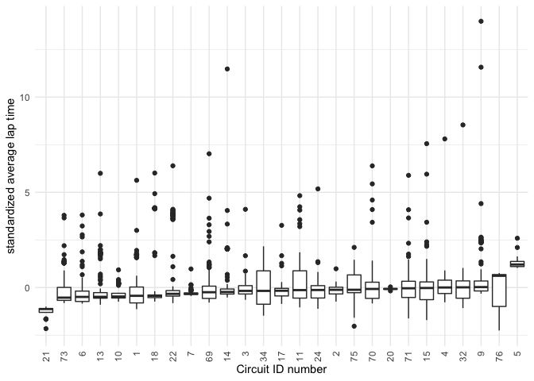
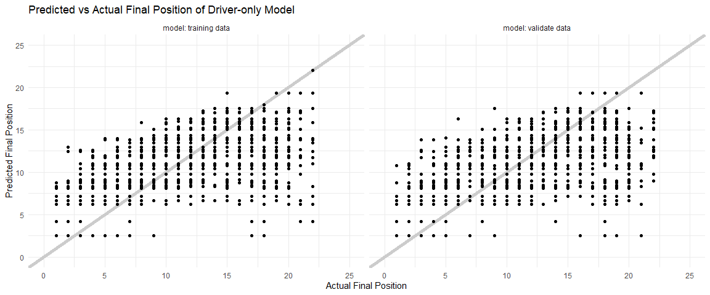
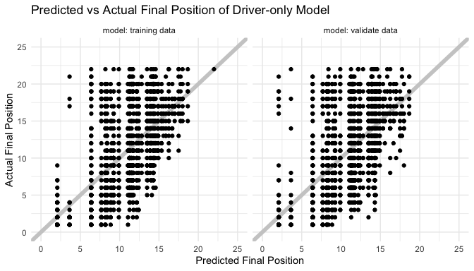

## \=======

title: "" author: “Lilo Heinrich, Tim Novak, and Colin Takeda” date:
12-14-2020 output: github\_document: toc: true pdf\_document: toc: true
—

<center>

<h1>

Formula 1 Racing: <br /> Does the car or the driver have the greater
impact?

</h1>

</center>

## Data Background

#### Context

The Formula 1 World Championship has been one of the premier forms of
auto racing around the world since its inaugural season in 1950. The
word “formula” refers to the set of rules to which all participants’
cars must conform. A Formula 1 season consists of a series of Grands
Prix races which take place worldwide on circuits and closed public
roads.

#### Source

The [Formula 1 World
Championships](https://www.kaggle.com/rohanrao/formula-1-world-championship-1950-2020)
dataset consists of all information on the Formula 1 races, drivers,
constructors, qualifying, circuits, lap times, pit stops, and
championships for every season from 1950 to 2020.

This dataset was published by Rohan Rao, a Data Scientist who goes by
the name [Vopani](https://www.kaggle.com/rohanrao) on Kaggle. (Fun fact:
he is also the reigning National Sudoku Champion of India.) He compiled
this dataset using the [Ergast Developer API](http://ergast.com/mrd/),
an experimental web service that provides a historical record of motor
racing data for non-commercial purposes. The API provides data
specifically for the Formula One series, from the beginning of the world
championships in 1950 up to the present season.

The Ergast API website does not give any details about their data
collection procedures, but their data is very thorough and complete.
Additionally, Formula 1 world championships are internationally
televised and race results are publicly accessible information [(see
official Formula 1 website)](https://www.formula1.com/en/results.html),
so there is no reason to doubt the accuracy of the data reported.

-----

## Investigation Question

#### Does the car or the driver have the greater impact?

Unlike most sports, Formula 1 racing is heavily reliant on the
performance capability of their equipment, which is their cars that are
created by the constructors. To what extent do the constructor and
driver predict race performance, and which one has the greater
predictive capability?

-----

## Data Tidying

The data came in many separate files, including `results.csv`,
`drivers.csv`, `constructors.csv`, `circuits.csv`, `races.csv`,
`status.csv`, and `laptimes.csv`. Our first step was to join all of
these data frames together by their relevant ID numbers and replace the
missing values with `NA`.

In our dataset we kept these columns:

  - resultId
  - raceId
  - driverId
  - constructorId
  - positionOrder
  - laps
  - fastestLapSpeed
  - statusId
  - driver\_name
  - constructor\_name
  - year
  - round
  - circuitId
  - race\_name
  - status
  - circuit\_name

#### Time data

The column `milliseconds` reports the race completion time for all of
the drivers that were able to finish the race. However, drivers are
often unable to complete the full race due to collisions, car
breakdowns, or other problems, leaving many missing values for total
race time. We discarded `milliseconds` and created a second dataset
where we supplemented information from `laptimes.csv` to compute total
race time even when race status was not finished. The lap times were
understandably missing when the number of laps completed was 0, so we
removed these observations. Overall, we still only have lap times for
9,233 of our 24,900 though.

In this time-filtered dataset we added these columns:

  - total\_time
  - avg\_lap
  - circuit\_avg\_lap
  - circuit\_lap\_sd
  - std\_avg\_lap

<!-- end list -->

    ## # A tibble: 2,767 x 16
    ##    resultId raceId driverId constructorId positionOrder  laps fastestLapSpeed
    ##       <dbl>  <dbl>    <dbl>         <dbl>         <dbl> <dbl>           <dbl>
    ##  1    22130    900        3           131             1    57            206.
    ##  2    22131    900      825             1             2    57            205.
    ##  3    22132    900       18             1             3    57            205.
    ##  4    22133    900        4             6             4    57            205.
    ##  5    22134    900      822             3             5    57            206.
    ##  6    22135    900      807            10             6    57            206.
    ##  7    22136    900        8             6             7    57            205.
    ##  8    22137    900      818             5             8    57            204.
    ##  9    22138    900      826             5             9    57            203.
    ## 10    22139    900      815            10            10    57            206.
    ## # ... with 2,757 more rows, and 9 more variables: statusId <dbl>,
    ## #   driver_name <chr>, constructor_name <chr>, year <dbl>, round <dbl>,
    ## #   circuitId <dbl>, race_name <chr>, status <chr>, circuit_name <chr>

    ## # A tibble: 2,767 x 16
    ##    resultId raceId driverId constructorId positionOrder  laps fastestLapSpeed
    ##       <dbl>  <dbl>    <dbl>         <dbl>         <dbl> <dbl>           <dbl>
    ##  1    22130    900        3           131             1    57            206.
    ##  2    22131    900      825             1             2    57            205.
    ##  3    22132    900       18             1             3    57            205.
    ##  4    22133    900        4             6             4    57            205.
    ##  5    22134    900      822             3             5    57            206.
    ##  6    22135    900      807            10             6    57            206.
    ##  7    22136    900        8             6             7    57            205.
    ##  8    22137    900      818             5             8    57            204.
    ##  9    22138    900      826             5             9    57            203.
    ## 10    22139    900      815            10            10    57            206.
    ## # ... with 2,757 more rows, and 9 more variables: statusId <dbl>,
    ## #   driver_name <chr>, constructor_name <chr>, year <dbl>, round <dbl>,
    ## #   circuitId <dbl>, race_name <chr>, status <chr>, circuit_name <chr>

#### Changes in racing ruleset/vehicle design through the years

This data is for 70 years of races and over that period of time [formula
racing has changed a lot](https://youtu.be/hgLQWIAaCmY). This means that
many factors will change through the years depending on the rule set
that has been put in place. To help mitigate this problem we decided to
filter down to the subset of data which follows the most recent set of
rules for the races. The [most recent significant set of
rules](https://en.wikipedia.org/wiki/Formula_One_engines#2014%E2%80%932021)
dates back to 2014 where the allowed engine specifications were changed.
Thus we filtered our data to only examine the data from 2014 onwards.

#### Potential Problems

  - Some examples of [constructor name
    changes](https://www.reddit.com/r/formula1/comments/1dos3r/i_made_a_diagram_to_show_how_current_f1_teams/)
  - New drivers are skewed because they don’t have as many data points
    yet
  - Teams and drivers are correlated, in that the best drivers tend to
    get hired by the best teams

-----

## Exploratory Data Analysis

#### Standardized Average Lap Time

<!-- -->

As shown in the graph above, final position is heavily reliant on how
many laps the driver was able to complete. And almost a third of the
time, collisions or car troubles put drivers out of commission before
the race is finished. These final standings are not reflective of how
well the driver was doing before that point, so we decided to use
average lap time to create a more comprehensive performance metric.

Average lap time is a comprehensive measure of how well a driver
performed in a race because it is informed only on the laps they were
able to complete, unlike final position. The only problem is that it
doesn’t account for the effect of circuit on lap time, so we need to
correct for this difference across circuits.

<!-- -->

The average lap time varies across circuits due to the differences in
track length and shape, so we need a way to compare average lap time
across circuits. Dividing average lap time by average lap time per
circuit doesn’t work because it doesn’t account for the range of average
lap time on each circuit. To correct for the impact of circuit on
average lap time, we standardized by circuit:

\[\mu = \sum_{i}^{n} \frac{x_i}{n}\]

\[\sigma = \sqrt{\sum_{i}^{n} \frac{(x_i - \mu)^2}{n}}\]

\[z = \frac{x-\mu}{\sigma}\]

where \(x\) is the data, \(\mu\) is the mean, \(\sigma\) is the standard
deviation, and \(z\) is the standard score of \(x\)

#### Standardized Average Lap Time by Circuit

<!-- -->

The graph above shows a visual comparison of standardized average lap
time by circuit. The slope of the median is small in magnitude relative
to the range of the standardized average lap time, showing that
standardizing the average lap time successfully minimizes the effect of
circuit.

#### Modeling by Standard Average Lap Time

First, let’s model the a subset of the data that has completed times to
get a sense of how informative a linear model of **standardized average
lap time** is for our dataset, solely based upon driver, constructor,
and a combination of the two.

``` r
f_driv_sal <-
  df_timedata %>%
  lm(
    data = .,
    formula = std_avg_lap ~ as.factor(driverId)
  )

f_cons_sal <- 
  df_timedata %>% 
  lm(
    data = .,
    formula = std_avg_lap ~ as.factor(constructorId)
  )

f_drivcons_sal <- 
  df_timedata %>% 
  lm(
    data = .,
    formula = std_avg_lap ~ as.factor(driverId) + as.factor(constructorId)
  )
```

    ## Subset Fit - Just Driver

    ##   Rsquare 0.05762464

    ##   MSE 1.133674

    ## Subset Fit - Just Constructor

    ##   Rsquare 0.04821027

    ##   MSE 1.145

    ## Subset Fit - Driver and Constructor

    ##   Rsquare 0.08991716

    ##   MSE 1.094826

Starting with looking at the mean square error (MSE) we can compare the
different fits against one another. Between fits, the error is lowest
with both *driver and constructor*. The “goodness of fit” is best with
both factors involved, which may imply that both are informative towards
standard average lap time. However, the difference is quite small
between MSEs, so the predictive capabilities of both still seem minute.
The order of best to worst fit, solely based upon MSE, is **driver and
constructor, just driver, and just constructor.** These results may
imply that driver is a better predictor of outcome than constructor, but
this is not necessarily the case.

Looking next at our R-square value we see that our models *does not*
encapsulate much of the variance of the data. We see the fraction of the
variance of the data ranges from 4.8% to 8.9%. The order of best to
worst fit, solely based upon R-square, is **driver and constructor, just
driver, and finally just constructor.**

These models should be taken with a grain or more of salt as we are
using the entire subset of data set to create them, so they are
extremely optimistic with the fit and do not cover all observations
available. Also, as we see from our R-square values, using driver and/or
constructor does not seem very fruitful for modeling standardized
average lap time. While this was a useful metric for comparing across
circuits, it does not seem to be as useful for modeling. Instead, we
should explore other variables to indicate performance.

## Final Position Order

#### Driver and Constructor by Final Position Order

<!-- -->

We can see that when we plot the final position vs the driver of the
vehicle there does seem to be a correlation. in that some drivers tend
to outperform the average and some drivers tend to underperform the
average. If we examine the names the highly performing racers tend to be
the racers more well renown for their skill such as [Louis Hamelton]()
and [](). This suggests that there is a correlation between the driver
performance and the standing in the race and we can see this play out in
the relatively linear relation between the two variables. An interesting
relation we can see in the data are ‘plateaus’ in the median values
where there are sets of drivers with similar performances.

<!-- -->

When we plot the constructor vs the final position order we see
generally that the higher performing constructors are associated with a
low position order, and the lower performing constructors are associated
with a lower position order, however this is not a linear relationship.
The highest performing constructors account for most of the low final
position orders and the lowest performing constructors account for much
of the high final position orders. But middle performing constructors
all seem to have similar performance.

Taken together we can see that the driver and constructor graphs are
correlated with the final position order so it is likely that both of
them help account for the final position order, but they might not be
the sole determining factors. The more linear relationship of driver
with final position order suggests that the driver is slightly more
predictive of the final position order than the less linear vehicle
constructor.

#### Modelling by Final Position Order

Next, we will model the entire data set

``` r
df_data_with_rows <- tibble::rowid_to_column(df_data, "ID")

df_validate_pos <-
  df_data_with_rows %>%
  group_by(driverId, constructorId) %>% 
  slice_sample(prop = 0.5) %>% 
  ungroup()

df_train_pos <-
  anti_join(
    df_data_with_rows,
    df_validate_pos,
    by = "ID"
  )

df_train_pos
```

    ## # A tibble: 1,405 x 17
    ##       ID resultId raceId driverId constructorId positionOrder  laps
    ##    <int>    <dbl>  <dbl>    <dbl>         <dbl>         <dbl> <dbl>
    ##  1     1    22130    900        3           131             1    57
    ##  2     2    22131    900      825             1             2    57
    ##  3     6    22135    900      807            10             6    57
    ##  4     7    22136    900        8             6             7    57
    ##  5     9    22138    900      826             5             9    57
    ##  6    10    22139    900      815            10            10    57
    ##  7    11    22140    900       16            15            11    56
    ##  8    13    22142    900      820           206            13    55
    ##  9    14    22143    900      824           206            14    49
    ## 10    16    22145    900      813           208            16    29
    ## # ... with 1,395 more rows, and 10 more variables: fastestLapSpeed <dbl>,
    ## #   statusId <dbl>, driver_name <chr>, constructor_name <chr>, year <dbl>,
    ## #   round <dbl>, circuitId <dbl>, race_name <chr>, status <chr>,
    ## #   circuit_name <chr>

``` r
df_validate_pos
```

    ## # A tibble: 1,362 x 17
    ##       ID resultId raceId driverId constructorId positionOrder  laps
    ##    <int>    <dbl>  <dbl>    <dbl>         <dbl>         <dbl> <dbl>
    ##  1  2148    24283   1014        1           131             1    66
    ##  2   767    22898    945        1           131             2    55
    ##  3  1948    24083   1004        1           131             1    53
    ##  4   944    23075    955        1           131             5    51
    ##  5  2588    24726   1036        1           131             1    66
    ##  6  2351    24489   1024        1           131             4    61
    ##  7  2708    24846   1042        1           131             1    66
    ##  8  2011    24146   1007        1           131             4    71
    ##  9  1629    23763    988        1           131             2    55
    ## 10  1889    24024   1001        1           131             2    44
    ## # ... with 1,352 more rows, and 10 more variables: fastestLapSpeed <dbl>,
    ## #   statusId <dbl>, driver_name <chr>, constructor_name <chr>, year <dbl>,
    ## #   round <dbl>, circuitId <dbl>, race_name <chr>, status <chr>,
    ## #   circuit_name <chr>

``` r
f_driv_pos <-
  df_train_pos %>%
  lm(
    data = .,
    formula = positionOrder ~ as.factor(driverId)
  )

f_cons_pos <- 
  df_train_pos %>% 
  lm(
    data = .,
    formula = positionOrder ~ as.factor(constructorId)
  )

f_drivcons_pos <- 
  df_train_pos %>% 
  lm(
    data = .,
    formula = positionOrder ~ as.factor(driverId) + as.factor(constructorId)
  )
```

    ## Train Fit - Just Driver

    ##   Rsquare 0.3410123

    ##   MSE 24.05458

    ## Train Fit - Just Constructor

    ##   Rsquare 0.3442954

    ##   MSE 23.93227

    ## Train Fit - Driver and Constructor

    ##   Rsquare 0.3705173

    ##   MSE 22.98629

#### Assessing our Models

<!-- --><!-- --><!-- -->
Above is a visualization of the actual vs. predicted final position of
our linear models. The shape of the training data graph closely
resembles the shape of the validation data graph in each case.

There is a noticeable gap in predictions between fourth and sixth place

#### Quantifying uncertaintly

<!-- -->

If possible given your data, report all estimates with confidence /
prediction / tolerance intervals. If not possible, clearly explain why
it is not possible to provide intervals and document what sources of
uncertainty are not quantified.

-----

## Conclusion

-----

## Rubrics

Questions to answer:

  - What question did you set out to answer?
  - What data did you find to help answer that question?
  - What is the relevant background on your question?
  - What level of (quantified) certainty do you have in your results?
  - What conclusions did you come to?
  - What questions do you have remaining?
  - Make sure your report contains at least one presentation-quality
    figure

Observed:

  - (The usual stuff)
  - Must provide background
  - Must posit a question

Supported:

  - (The usual stuff)
  - Some analysis must support answering question

Assessed:

  - (The usual stuff)
  - All estimates must be provided with some quantification of
    uncertainty (e.g. confidence / prediction / tolerance intervals), OR
    a justification for why producing an interval is not possible and
    documentation for sources of uncertainty not accounted for.

Styled:

  - (The usual stuff)
  - Report must contain at least one presentation-quality figure
