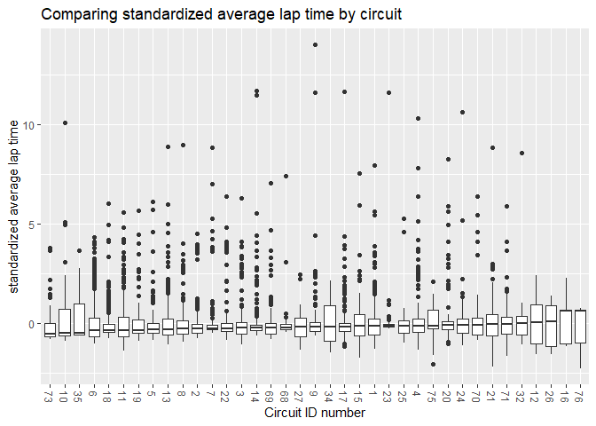

EDA on circuit and average lap time
================

  - [Computing Average Lap Time per
    Circuit](#computing-average-lap-time-per-circuit)
  - [Standardizing by Average Lap
    Time](#standardizing-by-average-lap-time)
  - [Assessing Standardized Average Lap Time
    vs. Circuit](#assessing-standardized-average-lap-time-vs.-circuit)
  - [Downselecting final data](#downselecting-final-data)

## Computing Average Lap Time per Circuit

Using average lap time as our indicator of performance:

  - Accounts for only the laps that the driver was able to complete,
    excluding when collisions or car troubles have happened, unlike
    final position.
  - Good overall performance indicator of the race, unlike fastest lap
    time which is only one lap out of many.
  - The only problem is that it doesn’t account for the difficulty of
    the circuit, so we need a metric for how hard a circuit is: the
    average lap time for that entire circuit.

<!-- end list -->

``` r
df_avglaptime %>%
  ggplot(aes(fct_reorder(as.factor(circuitId), circuit_avg_lap), circuit_avg_lap)) + 
  geom_point() +
  theme(axis.text.x = element_text(angle = 270, vjust = 0.5, hjust = 0)) + 
  labs(
    x = "Circuit ID number",
    y = "Average lap time (ms)"
  )
```

<!-- -->

## Standardizing by Average Lap Time

Looking at average lap time per circuit, we see a big difference. We
will need to create a metric that allows us to compare average lap time
across circuits.

Ratio (avg\_lap/circuit\_avg\_lap) doesn’t work because it doesn’t
account for the variability of average lap time; some circuits can be
completed much faster than average while others have a minimum average
lap time just below the average. This may be due to factors such as the
of the shape of the circuit, for example how many sharp turns it has.

How about we standardize average lap time using the following equations:

\[\mu = \sum_{i}^{n} \frac{x_i}{n}\]

\[\sigma = \sqrt{\sum_{i}^{n} \frac{(x_i - \mu)^2}{n}}\]

\[z = \frac{x-\mu}{\sigma}\]

where \(x\) is the data, \(\mu\) is the mean, \(\sigma\) is the standard
deviation, and \(z\) is the standard score of \(x\)

``` r
df_stdavglap <- 
  df_avglaptime %>%
  mutate(std_avg_lap = (avg_lap-circuit_avg_lap)/circuit_lap_sd)
df_stdavglap
```

    ## # A tibble: 9,233 x 29
    ##    resultId raceId driverId constructorId positionOrder  laps milliseconds
    ##       <dbl>  <dbl>    <dbl>         <dbl>         <dbl> <dbl>        <dbl>
    ##  1        1     18        1             1             1    58      5690616
    ##  2        2     18        2             2             2    58      5696094
    ##  3        3     18        3             3             3    58      5698779
    ##  4        4     18        4             4             4    58      5707797
    ##  5        5     18        5             1             5    58      5708630
    ##  6        6     18        6             3             6    57           NA
    ##  7        7     18        7             5             7    55           NA
    ##  8        8     18        8             6             8    53           NA
    ##  9        9     18        9             2             9    47           NA
    ## 10       10     18       10             7            10    43           NA
    ## # ... with 9,223 more rows, and 22 more variables: fastestLap <dbl>,
    ## #   rank <dbl>, fastestLapTime <time>, fastestLapSpeed <dbl>, statusId <dbl>,
    ## #   driver_name <chr>, driver_nationality <chr>, constructor_name <chr>,
    ## #   constructor_nationality <chr>, year <dbl>, round <dbl>, circuitId <dbl>,
    ## #   race_name <chr>, status <chr>, circuit_name <chr>, circuitRef <chr>,
    ## #   circuit_country <chr>, total_time <dbl>, avg_lap <dbl>,
    ## #   circuit_avg_lap <dbl>, circuit_lap_sd <dbl>, std_avg_lap <dbl>

``` r
df_stdavglap %>%
  select(raceId, driverId, positionOrder, laps, status, avg_lap, std_avg_lap)
```

    ## # A tibble: 9,233 x 7
    ##    raceId driverId positionOrder  laps status    avg_lap std_avg_lap
    ##     <dbl>    <dbl>         <dbl> <dbl> <chr>       <dbl>       <dbl>
    ##  1     18        1             1    58 Finished   98114.     -0.110 
    ##  2     18        2             2    58 Finished   98209.     -0.0997
    ##  3     18        3             3    58 Finished   98255.     -0.0948
    ##  4     18        4             4    58 Finished   98410.     -0.0783
    ##  5     18        5             5    58 Finished   98425.     -0.0768
    ##  6     18        6             6    57 +1 Lap    100082.      0.0985
    ##  7     18        7             7    55 Engine     98864.     -0.0303
    ##  8     18        8             8    53 Engine     99535.      0.0406
    ##  9     18        9             9    47 Collision  99291.      0.0148
    ## 10     18       10            10    43 Accident   96896.     -0.239 
    ## # ... with 9,223 more rows

Interestingly, although positionOrder and lap time standardized by
circuit have some relationship, there are some notable examples that I
have found in race 18 where this isn’t the case:

  - Driver 6 had a status of “+1 Lap” (meaning that they were lapped by
    the car ahead of them) and a notably larger average lap time than
    the 5th and 7th place. That caused the std\_avg\_lap to be much
    higher than its’ neighbors. It appears that this driver only
    received 6th place because they completed more laps of the race than
    the 7th place driver was able to.
  - The driver placing 16th had a very high std\_avg\_lap, possibly due
    to their Hydraulics issue shown in status, yet place 22 went to
    someone with a lower std\_avg\_lap because they were Disqualified.
  - Interestingly, driver 7 had a lower std\_avg\_lap than driver 8, but
    completed 2 more laps. Completing more of the race must have earned
    them a higher place, but driver 8 was actually performing better
    before they had engine trouble.
  - The same swapped position order and std\_avg\_lap can be seen with
    drivers 9 and 10.

These examples illustrate how the metric of std\_avg\_lap effectively
combats the impact of status and number of laps driven while still
capturing overall performance in a way that is comparable cross-circuit,
something that the metrics positionOrder and fastestLapSpeed cannot do.

This std\_avg\_lap metric also highlights how variable the results of
formula races can be due to car breakdowns and collisions, that the
final ranking isn’t necessarily indicative of performance if the racer
was unable to finish the whole race.

``` r
df_stdavglap %>%
  ggplot(aes(as.factor(positionOrder), std_avg_lap)) +
  geom_boxplot() + 
  theme(axis.text.x = element_text(angle = 270, vjust = 0.5, hjust = 0)) + 
  labs(
    x = "Position number",
    y = "standardized average lap time",
    title = "Comparing standardized average lap time by final position"
  )
```

<!-- -->

``` r
df_stdavglap %>%
  ggplot(aes(as.factor(positionOrder), std_avg_lap)) +
  geom_boxplot() + 
  theme(axis.text.x = element_text(angle = 270, vjust = 0.5, hjust = 0)) + 
  ylim(-2, 2) +
  labs(
    x = "Position number",
    y = "standardized average lap time",
    title = "Comparing standardized average lap time by final position"
  )
```

    ## Warning: Removed 384 rows containing non-finite values (stat_boxplot).

<!-- -->

``` r
df_stdavglap %>%
  filter(circuitId %% 2 == 1) %>%
  ggplot(aes(as.factor(positionOrder), std_avg_lap)) +
  geom_boxplot() + 
  theme(axis.text.x = element_text(angle = 270, vjust = 0.5, hjust = 0)) + 
  facet_wrap(vars(circuitId)) +
  labs(
    x = "Position number",
    y = "standardized average lap time",
    title = "Comparing standardized average lap time by final position"
  )
```

<!-- -->

First of all, the graph of standardized average lap time by final
position shown above confirms the obvious: final ranking and
standardized average lap time are related. The faster you drive, the
more likely you are to win the race\!

Secondly, the graph faceted by circuit shows that this relationship is
different for each track, and that there is an increasing variability in
the higher positions. This is almost certainly explained by the fact
that collisions or other car troubles reduce the likelihood of being
able to finish the race, thus increasing their position number,
independent of how well they were performing before their accident.

Also, I hypothesize that the vertical stratification is due to more
competitive races raising the standard for placing high, even when
competing on the same track.

## Assessing Standardized Average Lap Time vs. Circuit

``` r
df_stdavglap %>%
  ggplot(aes(fct_reorder(as.factor(circuitId), std_avg_lap), std_avg_lap)) +
  geom_boxplot() + 
  theme(axis.text.x = element_text(angle = 270, vjust = 0.5, hjust = 0)) + 
  labs(
    x = "Circuit ID number",
    y = "standardized average lap time",
    title = "Comparing standardized average lap time by circuit"
  )
```

<!-- -->

``` r
df_stdavglap %>%
  ggplot(aes(fct_reorder(as.factor(circuitId), std_avg_lap), std_avg_lap)) +
  geom_boxplot() + 
  theme(axis.text.x = element_text(angle = 270, vjust = 0.5, hjust = 0)) + 
  labs(
    x = "Circuit ID number",
    y = "standardized average lap time",
    title = "Comparing standardized average lap time by circuit"
  ) + 
  ylim(-2, 2)
```

    ## Warning: Removed 384 rows containing non-finite values (stat_boxplot).

<!-- -->

I am using this graph to visually compare the mean, quantiles, and
outliers of standardized average lap time by circuit in order to check
that std\_avg\_lap minimizes the effect of circuit as much as possible.
Generally, it seems that it does, because the mean stays at an absolute
value less than 0.5 for almost every circuit.

However, circuits 16 and 76 have a high outlying mean and circuits 73,
10, and 35 have a low outlying mean. And interestingly, there are no
high outlying datapoints for the 4 circuits with the highest
std\_avg\_lap. Perhaps the outliers in the mean std\_alt are caused by
track length? Circuit 73 is the Red Bull circuit, one of the shortest in
all of Formula racing.

## Downselecting final data

``` r
df_final <-
  df_stdavglap %>%
  # Getting rid of less useful cols
  select(-c(resultId, milliseconds, rank, fastestLap, fastestLapTime, fastestLapSpeed, circuit_avg_lap, circuit_lap_sd)) %>%
  
  # Getting rid of country info
  select(-c(driver_nationality, constructor_nationality, circuit_country)) %>%

  # Getting rid of cols represented two different ways 
  select(-c(race_name, driverId, constructorId, circuit_name, statusId)) %>%
  
  # Getting rid of less useful metrics
  select(-c(laps, total_time, avg_lap))

df_final
```

    ## # A tibble: 9,233 x 10
    ##    raceId positionOrder driver_name constructor_name  year round circuitId
    ##     <dbl>         <dbl> <chr>       <chr>            <dbl> <dbl>     <dbl>
    ##  1     18             1 "Lewis Ham~ McLaren           2008     1         1
    ##  2     18             2 "Nick Heid~ BMW Sauber        2008     1         1
    ##  3     18             3 "Nico Rosb~ Williams          2008     1         1
    ##  4     18             4 "Fernando ~ Renault           2008     1         1
    ##  5     18             5 "Heikki Ko~ McLaren           2008     1         1
    ##  6     18             6 "Kazuki Na~ Williams          2008     1         1
    ##  7     18             7 "S\xe9bast~ Toro Rosso        2008     1         1
    ##  8     18             8 "Kimi R\xe~ Ferrari           2008     1         1
    ##  9     18             9 "Robert Ku~ BMW Sauber        2008     1         1
    ## 10     18            10 "Timo Gloc~ Toyota            2008     1         1
    ## # ... with 9,223 more rows, and 3 more variables: status <chr>,
    ## #   circuitRef <chr>, std_avg_lap <dbl>
