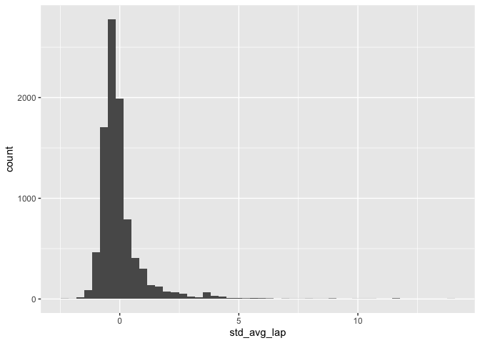
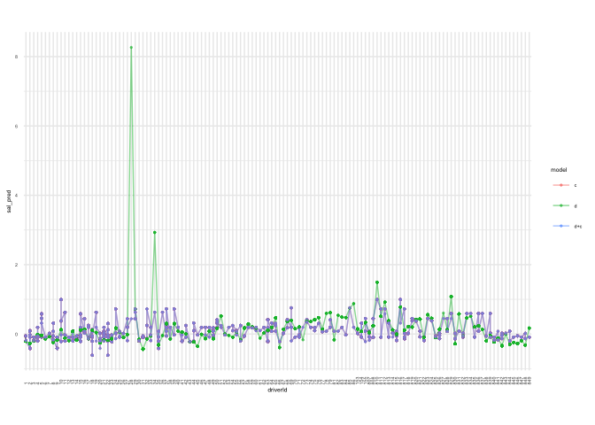

Modeling Avg Lap Time for Racers and Constructors
================

  - [EDA](#eda)
      - [Historgrams](#historgrams)
  - [Modeling Using Standard Average Lap
    Time](#modeling-using-standard-average-lap-time)
      - [Visualizing Std Average Lap
        Time](#visualizing-std-average-lap-time)
      - [Creating Model](#creating-model)
  - [Creating Train and Validation Data
    Frames](#creating-train-and-validation-data-frames)
      - [Visualizing Prediction](#visualizing-prediction)
  - [Modeling Using Position Order](#modeling-using-position-order)

## EDA

### Historgrams

``` r
df_avglaptime %>% 
  filter(avg_lap <= 200000) %>% 
  ggplot(aes(avg_lap)) + 
  geom_histogram(bins = 50) +
  labs(
    title = "Average Lap Time Histogram", 
    x = "Average Lap Time (ms)"
  ) + 
  theme_minimal()
```

<!-- -->

``` r
df_avglaptime %>% 
  ggplot(aes(circuit_avg_lap)) + 
  geom_histogram(bins = 60) + 
  labs(
    title = "Circuit Average Lap Time Histogram", 
    x = "Average Circuit Lap Time (ms)"
  ) + 
  theme_minimal()
```

<!-- -->

``` r
df_avglaptime %>% 
  mutate(
    year = as.factor(year), 
    circuit_name = fct_reorder(circuit_name, circuit_avg_lap)) %>% 
  ggplot(aes(circuit_name, circuit_avg_lap)) + 
  geom_jitter(aes(color = year), alpha = 1/14) +
  coord_flip() + 
  labs(title = "Circuit Average Lap for GPs containing Drivers Who Have Driven For Multiple Teams") +
  theme_minimal() +
  theme(plot.title = element_text(size = 9))
```

<!-- -->

***Observations***

  - Same Grands Prix can have vastly different times, most likely due to
    different courses under the same GP name
      - See United States GP and French GP
  - Also the circuit average lap time seems to diverge onto one time and
    doesn’t seem to diverge much
  - `SO MUCH data` that it is hard to visualize the number of
    observations for a single GP
      - What is the best way to visualize these observations??

## Modeling Using Standard Average Lap Time

### Visualizing Std Average Lap Time

``` r
df_stdavglap %>% 
  ggplot(aes(std_avg_lap)) +
  geom_histogram(bins = 50)
```

<!-- -->

### Creating Model

``` r
fullfit_driver <-
  df_stdavglap %>%
  lm(
    data = .,
    formula = std_avg_lap ~ as.factor(driverId)
  )

print("Full Fit - Just Driver")
```

    ## [1] "Full Fit - Just Driver"

``` r
cat("Rsquare", rsquare(fullfit_driver, df_stdavglap), "\n")
```

    ## Rsquare 0.05748965

``` r
cat("MSE", mse(fullfit_driver, df_stdavglap), "\n")
```

    ## MSE 0.9387334

``` r
fullfit_constructor <- 
  df_stdavglap %>% 
  lm(
    data = .,
    formula = std_avg_lap ~ as.factor(constructorId)
  )

print("Full Fit - Just Constructor")
```

    ## [1] "Full Fit - Just Constructor"

``` r
cat("Rsquare", rsquare(fullfit_constructor, df_stdavglap), "\n")
```

    ## Rsquare 0.04633339

``` r
cat("MSE", mse(fullfit_constructor, df_stdavglap), "\n")
```

    ## MSE 0.9498449

``` r
fullfit_driver_constructor <- 
  df_stdavglap %>% 
  lm(
    data = .,
    formula = std_avg_lap ~ as.factor(driverId) + as.factor(constructorId)
  )

print("Full Fit - Driver and Constructor")
```

    ## [1] "Full Fit - Driver and Constructor"

``` r
cat("Rsquare", rsquare(fullfit_driver_constructor, df_stdavglap), "\n")
```

    ## Rsquare 0.08119187

``` r
cat("MSE", mse(fullfit_driver_constructor, df_stdavglap), "\n")
```

    ## MSE 0.9151261

***Observations***

  - Looking at our mean square error first we can compare our different
    models against one another
      - Between models, the error is lowest with both `driver and
        constructor` which is a good sign that both are informative
        towards lap time
  - The order of best model to worst, solely based upon MSE, is driver &
    constructor, just driver, and finally just constructor
      - These results may imply that driver is a better predictor of
        outcome than constructor, but I will argue why not next
  - Looking next at our rsquared value we see that our models do **not**
    have very good coverage of the data
  - We are looking at each model only covering around `5.7% to 8.1%` of
    the data, which calls into validity the comparisons made for our MSE
  - The order of best model to worst, solely based upon rsquare, is
    driver & constructor, just driver, and finally just constructor
  - So overall, the overall standings seem to follow the exact same
    trend seen in both MSE and rsquare
  - These models should be taken with a grain or more of salt as we are
    using the entire data set to create these linear models
  - Next, we’ll see how constructor and driver stacks up against a
    training and validation data set

## Creating Train and Validation Data Frames

``` r
#Setting seed for temporary repeatability
#set.seed("101")

#Getting number of observations to feed into n for df_train
number_obs <- df_stdavglap %>% 
  group_by(driverId, circuitId) %>% 
  summarize(n = n()) %>% 
  pull(n)
```

    ## `summarise()` regrouping output by 'driverId' (override with `.groups` argument)

``` r
#Sampling by 
df_train <-
  df_stdavglap %>%
  group_by(driverId, circuitId) %>% 
  slice_sample(n = 2) %>% 
  ungroup()

df_validate <-
  anti_join(
    df_stdavglap,
    df_train,
    by = "ID"
  )

df_train %>% arrange(ID)
```

    ## # A tibble: 4,210 x 22
    ##       ID resultId raceId driverId constructorId positionOrder  laps
    ##    <int>    <dbl>  <dbl>    <dbl>         <dbl>         <dbl> <dbl>
    ##  1     5        5     18        5             1             5    58
    ##  2     6        6     18        6             3             6    57
    ##  3     7        7     18        7             5             7    55
    ##  4    10       10     18       10             7            10    43
    ##  5    12       12     18       12             4            12    30
    ##  6    26       31     19       14             9             9    56
    ##  7    28       33     19       12             4            11    56
    ##  8    31       36     19        3             3            14    55
    ##  9    33       38     19       11             8            16    54
    ## 10    34       39     19        6             3            17    54
    ## # … with 4,200 more rows, and 15 more variables: fastestLapSpeed <dbl>,
    ## #   statusId <dbl>, driver_name <chr>, constructor_name <chr>, year <dbl>,
    ## #   round <dbl>, circuitId <dbl>, race_name <chr>, status <chr>,
    ## #   circuit_name <chr>, total_time <dbl>, avg_lap <dbl>, circuit_avg_lap <dbl>,
    ## #   circuit_lap_sd <dbl>, std_avg_lap <dbl>

``` r
df_validate %>% arrange(ID)
```

    ## # A tibble: 5,023 x 22
    ##       ID resultId raceId driverId constructorId positionOrder  laps
    ##    <int>    <dbl>  <dbl>    <dbl>         <dbl>         <dbl> <dbl>
    ##  1     1        1     18        1             1             1    58
    ##  2     2        2     18        2             2             2    58
    ##  3     3        3     18        3             3             3    58
    ##  4     4        4     18        4             4             4    58
    ##  5     8        8     18        8             6             8    53
    ##  6     9        9     18        9             2             9    47
    ##  7    11       11     18       11             8            11    32
    ##  8    13       13     18       13             6            13    29
    ##  9    14       14     18       14             9            14    25
    ## 10    15       15     18       15             7            15    19
    ## # … with 5,013 more rows, and 15 more variables: fastestLapSpeed <dbl>,
    ## #   statusId <dbl>, driver_name <chr>, constructor_name <chr>, year <dbl>,
    ## #   round <dbl>, circuitId <dbl>, race_name <chr>, status <chr>,
    ## #   circuit_name <chr>, total_time <dbl>, avg_lap <dbl>, circuit_avg_lap <dbl>,
    ## #   circuit_lap_sd <dbl>, std_avg_lap <dbl>

``` r
trainfit_driver <-
  df_train %>%
  lm(
    data = .,
    formula = std_avg_lap ~ as.factor(driverId)
  )

print("Train Fit - Just Driver")
```

    ## [1] "Train Fit - Just Driver"

``` r
cat("Rsquare", rsquare(trainfit_driver, df_validate), "\n")
```

    ## Rsquare 0.0007279964

``` r
cat("MSE", mse(trainfit_driver, df_validate), "\n")
```

    ## MSE 0.9187088

``` r
trainfit_constructor <- 
  df_train %>% 
  lm(
    data = .,
    formula = std_avg_lap ~ as.factor(constructorId)
  )

print("Train Fit - Just Constructor")
```

    ## [1] "Train Fit - Just Constructor"

``` r
cat("Rsquare", rsquare(trainfit_constructor, df_validate), "\n")
```

    ## Rsquare 0.01655356

``` r
cat("MSE", mse(trainfit_constructor, df_validate), "\n")
```

    ## MSE 0.9040841

``` r
trainfit_driver_constructor <- 
  df_train %>% 
  lm(
    data = .,
    formula = std_avg_lap ~ as.factor(driverId) + as.factor(constructorId)
  )

print("Train Fit - Driver and Constructor")
```

    ## [1] "Train Fit - Driver and Constructor"

``` r
cat("Rsquare", rsquare(trainfit_driver_constructor, df_validate), "\n")
```

    ## Rsquare 0.01062505

``` r
cat("MSE", mse(trainfit_driver_constructor, df_validate), "\n")
```

    ## MSE 0.9097843

***Observations***

### Visualizing Prediction

``` r
names <- 
  df_stdavglap %>% 
  select(driverId, constructorId) %>% 
  mutate(driverId = as.factor(driverId),
         constructorId = as.factor(constructorId))

tibble(names) %>% 
  add_predictions(trainfit_driver, var = "sal_pred-d") %>%
  add_predictions(trainfit_constructor, var = "sal_pred-c") %>%
  add_predictions(trainfit_constructor, var = "sal_pred-d+c") %>%  
  pivot_longer(
    names_to = c(".value", "model"),
    names_sep = "-",
    cols = matches("sal")
  ) %>% 
  ggplot(aes(driverId, sal_pred, color = model)) +
  geom_line(aes(group = model), alpha = .5) +
  geom_point(size = .5, alpha = .5) +
  theme_minimal() +
  theme(
    aspect.ratio= 2/3,
    text = element_text(size = 5), 
    axis.text.x = element_text(angle = 90, vjust = 0.5, hjust = 0,
                               ) 
    )
```

<!-- -->

## Modeling Using Position Order

``` r
df_f1clean %>% 
  summary()
```

    ##     resultId         raceId        driverId     constructorId   
    ##  Min.   :    1   Min.   :   1   Min.   :  1.0   Min.   :  1.00  
    ##  1st Qu.: 6226   1st Qu.: 284   1st Qu.: 56.0   1st Qu.:  6.00  
    ##  Median :12450   Median : 497   Median :158.0   Median : 25.00  
    ##  Mean   :12451   Mean   : 511   Mean   :245.3   Mean   : 46.89  
    ##  3rd Qu.:18675   3rd Qu.: 751   3rd Qu.:345.0   3rd Qu.: 57.00  
    ##  Max.   :24905   Max.   :1044   Max.   :849.0   Max.   :213.00  
    ##                                                                 
    ##  positionOrder        laps         milliseconds        fastestLap   
    ##  Min.   : 1.00   Min.   :  0.00   Min.   : 1474899   Min.   : 2.00  
    ##  1st Qu.: 6.00   1st Qu.: 21.00   1st Qu.: 5415626   1st Qu.:31.00  
    ##  Median :12.00   Median : 52.00   Median : 5824409   Median :45.00  
    ##  Mean   :12.97   Mean   : 45.67   Mean   : 6249673   Mean   :41.95  
    ##  3rd Qu.:19.00   3rd Qu.: 66.00   3rd Qu.: 6429138   3rd Qu.:54.00  
    ##  Max.   :39.00   Max.   :200.00   Max.   :15090540   Max.   :78.00  
    ##                                   NA's   :18345      NA's   :18406  
    ##       rank       fastestLapTime    fastestLapSpeed     statusId     
    ##  Min.   : 0.00   Length:24900      Min.   : 89.54   Min.   :  1.00  
    ##  1st Qu.: 5.00   Class1:hms        1st Qu.:191.95   1st Qu.:  1.00  
    ##  Median :10.00   Class2:difftime   Median :203.67   Median : 11.00  
    ##  Mean   :10.53   Mode  :numeric    Mean   :202.33   Mean   : 17.86  
    ##  3rd Qu.:16.00                     3rd Qu.:215.40   3rd Qu.: 15.00  
    ##  Max.   :24.00                     Max.   :257.32   Max.   :139.00  
    ##  NA's   :18249                     NA's   :18406                    
    ##  driver_name        driver_nationality constructor_name  
    ##  Length:24900       Length:24900       Length:24900      
    ##  Class :character   Class :character   Class :character  
    ##  Mode  :character   Mode  :character   Mode  :character  
    ##                                                          
    ##                                                          
    ##                                                          
    ##                                                          
    ##  constructor_nationality      year          round          circuitId    
    ##  Length:24900            Min.   :1950   Min.   : 1.000   Min.   : 1.00  
    ##  Class :character        1st Qu.:1976   1st Qu.: 4.000   1st Qu.: 9.00  
    ##  Mode  :character        Median :1990   Median : 8.000   Median :18.00  
    ##                          Mean   :1989   Mean   : 8.258   Mean   :21.98  
    ##                          3rd Qu.:2005   3rd Qu.:12.000   3rd Qu.:32.00  
    ##                          Max.   :2020   Max.   :21.000   Max.   :76.00  
    ##                                                                         
    ##   race_name            status          circuit_name        circuitRef       
    ##  Length:24900       Length:24900       Length:24900       Length:24900      
    ##  Class :character   Class :character   Class :character   Class :character  
    ##  Mode  :character   Mode  :character   Mode  :character   Mode  :character  
    ##                                                                             
    ##                                                                             
    ##                                                                             
    ##                                                                             
    ##  circuit_country   
    ##  Length:24900      
    ##  Class :character  
    ##  Mode  :character  
    ##                    
    ##                    
    ##                    
    ##
